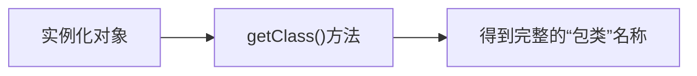

> 动态语言的关键。

---

## Java 基础知识图谱

---

## 反射大纲

1. Java反射机制概述
2. **理解Class类并获取Class类的实例**
3. 类的加载与ClassLoader的理解
4. **通过反射创建运行时类的对象**
5. 通过反射获取运行时类的完整结构
6. **通过反射调用运行时类的指定属性、指定方法等**
7. 反射的应用：动态代理

---

## Java反射机制概述

### Java Reflection

Reflection（反射）是被视为动态语言的关键，反射机制允许程序在执行期借助于Reflection API取得任何类的内部信息，并能直接操作任意对象的内部属性及方法。

### Java反射机制提供的功能

1. 在运行时判断任意一个对象所属的类
2. 在运行时构造任意一个类的对象
3. 在运行时判断任意一个类所具有的成员变量和方法
4. 在运行时调用任意一个对象的成员变量和方法
5. 生成动态代理

### 反射相关的主要API

- java.lang.`Class`: 代表一个类
- java.lang.reflect.`Method`: 代表类的方法
- java.lang.reflect.`Field`: 代表类的成员变量
- java.lang.reflect.`Constructor`: 代表类的构造方法

---

## 理解Class类并获取Class类的实例

在Object类中定义了以下的方法，此方法将被所有子类继承：

**public final Class getClass()**

以上的方法返回值的类型是一个Class类，此类是Java反射的源头，实际上所谓反射从程序的运行结果来看也很好理解，即：可以通过对象反射求出类的名称。

**正常方式：**

**反射方式：**

> 结尾

